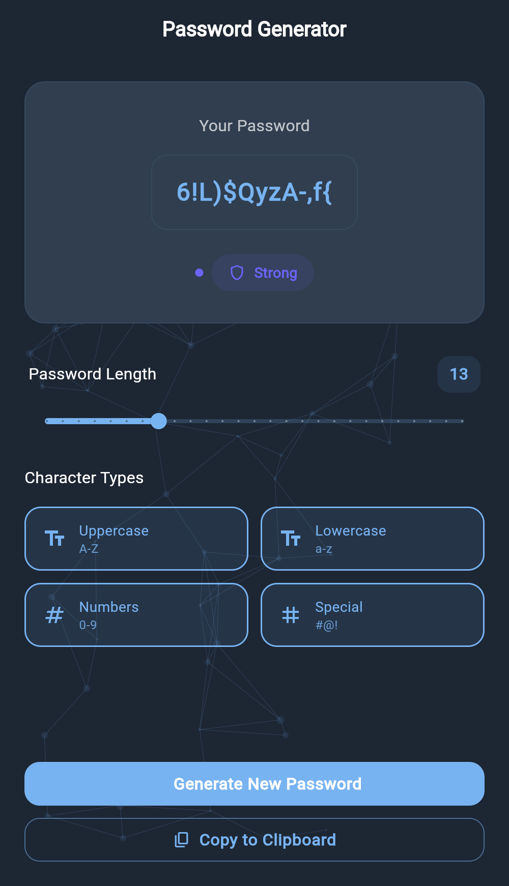

# Modern Password Generator

A beautiful and secure password generator built with Flutter, featuring a modern UI with particle animation background.



## Features

- 🔐 Generate secure passwords with customizable options
- ✨ Beautiful particle animation background
- 🎨 Modern and intuitive user interface
- 🌙 Dark mode support
- 📱 Responsive design for all screen sizes
- 🔄 Copy to clipboard functionality
- ⚡ Fast and efficient password generation

## Character Options

- Uppercase letters (A-Z)
- Lowercase letters (a-z)
- Numbers (0-9)
- Special characters (!@#$%^&*)

## Getting Started

### Prerequisites

- Flutter SDK (latest version)
- Dart SDK (latest version)
- Android Studio / VS Code with Flutter extensions

### Installation

1. Clone the repository:
```bash
git clone https://github.com/Nabeel-Shehzad/password-generator.git
```

2. Navigate to the project directory:
```bash
cd password-generator
```

3. Install dependencies:
```bash
flutter pub get
```

4. Run the app:
```bash
flutter run
```

## Project Structure

```
lib/
├── main.dart
├── src/
│   ├── constants/
│   │   └── app_constants.dart
│   ├── screens/
│   │   └── password_generator_screen.dart
│   ├── themes/
│   │   └── app_theme.dart
│   ├── utils/
│   │   └── password_generator.dart
│   └── widgets/
│       ├── particle_background.dart
│       ├── password_display_card.dart
│       └── password_options.dart
```

## Contributing

1. Fork the repository
2. Create your feature branch (`git checkout -b feature/amazing-feature`)
3. Commit your changes (`git commit -m 'Add some amazing feature'`)
4. Push to the branch (`git push origin feature/amazing-feature`)
5. Open a Pull Request

## License

This project is licensed under the MIT License - see the [LICENSE](LICENSE) file for details.

## Acknowledgments

- Flutter team for the amazing framework
- The open-source community for inspiration and support
